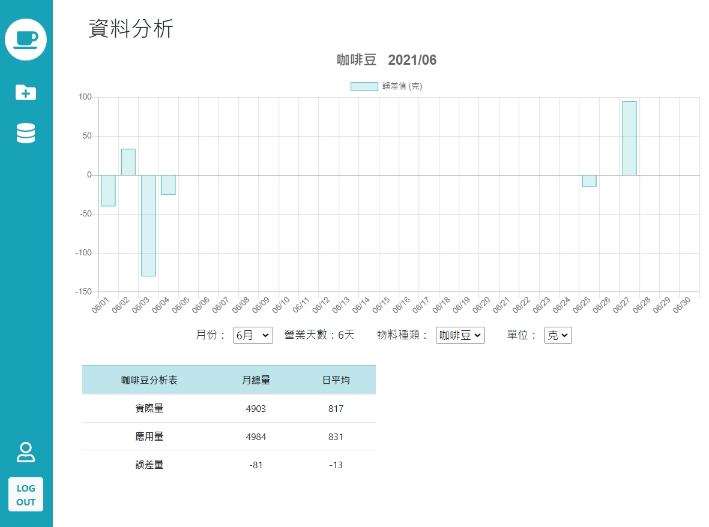

# cafe-inventory-front-vue
物料盤點系統前端頁面，使用者可建立每天的物料資訊，也可使用報表功能查看單月的圖表分析。

**操作圖**


**登記每日物料**


**查看單月報表**



**後台更動成分資訊**


**後臺使用者列表**


## 環境建置( prerequisites )

- vue 2.6.11
- bootstrap 4.6
- chart.js 2.9.4
- moment
- sweetalert2
- axios


## Project setup
```
npm install
```

### Compiles and hot-reloads for development
```
npm run serve
```

### Compiles and minifies for production
```
npm run build
```

### Lints and fixes files
```
npm run lint
```

### Customize configuration
See [Configuration Reference](https://cli.vuejs.org/config/).
